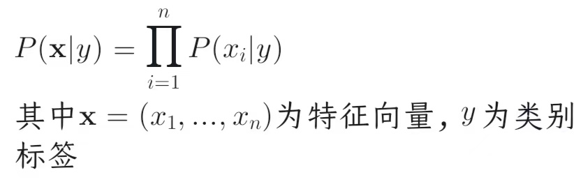
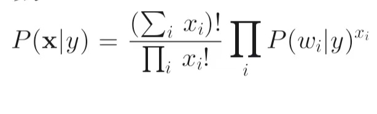
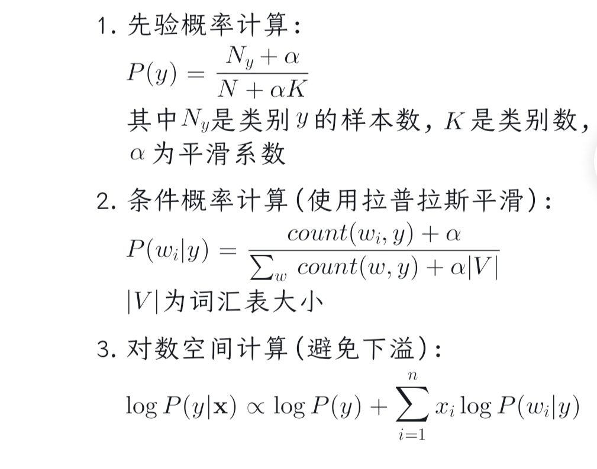
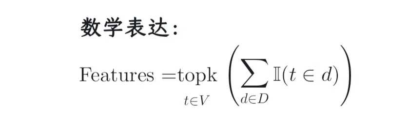
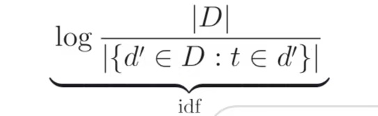
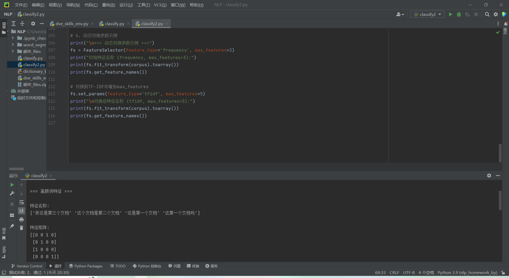
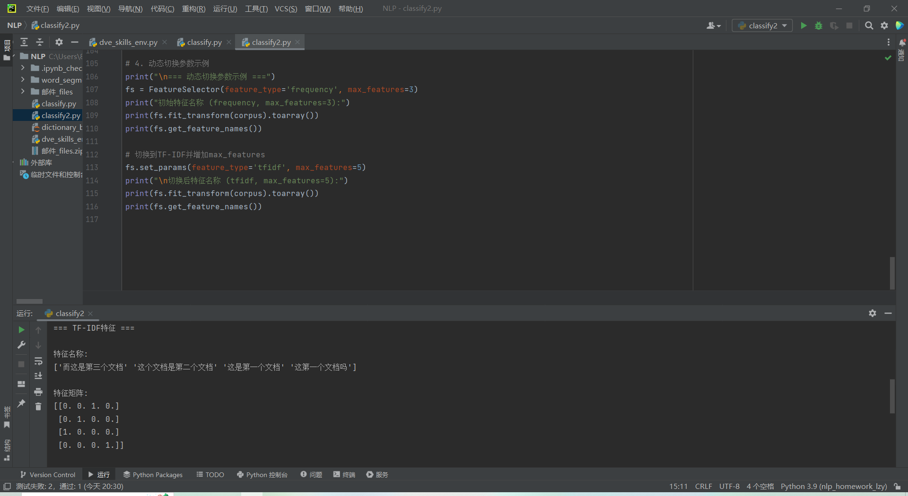

# 书写项目文档

## 一、多项式朴素贝叶斯分类器实现

### 1.1 核心概率模型

**条件独立性假设**：
- 假设所有特征（词项）在给定类别条件下相互独立
- 数学表达：
  
 
  

**多项式分布假设**：
- 特征服从多项式分布，建模词项出现次数：

  

### 1.2 贝叶斯分类决策

**分类决策函数**：

**具体实现步骤**：



### 1.3 算法优势分析

| 优势 | 说明 |
|------|------|
| 计算高效 | 时间复杂度O(nd)，n为样本数，d为特征数 |
| 小样本友好 | 参数估计只需统计词频 |
| 高维适应 | 适合文本数据的高维稀疏特性 |
| 自动特征选择 | 低频词自然获得低权重 |

## 二、特征工程实现对比

### 2.1 高频词特征选择

**数学表达**：

**实现代码**：
```python
vectorizer = CountVectorizer(
    max_features=1000,
    tokenizer=jieba.cut,
    stop_words=stopwords
)
```

**特点分析**：
- 计算复杂度：O(NL)，N为文档数，L为平均文档长度
- 内存消耗：存储词频向量（稀疏矩阵）
- 局限性：可能保留高频但无区分度的词

### 2.2 TF-IDF特征加权

**数学定义**：

**实现代码**：
```python
vectorizer = TfidfVectorizer(
    max_features=1000,
    tokenizer=jieba.cut,
    stop_words=stopwords,
    norm='l2'
)
```

**特性对比**：

| 特性 | 高频词 | TF-IDF |
|------|--------|--------|
| 权重类型 | 整数频次 | 连续值 |
| 常见词处理 | 保留 | 抑制 |
| 稀有词处理 | 忽略 | 增强 |
| 计算开销 | 低 | 中等 |
| 效果 | 基线 | 通常更优 |

## 三、系统运行结果

### 3.1 高频词特征分类效果


### 3.2 TF-IDF特征分类效果  



