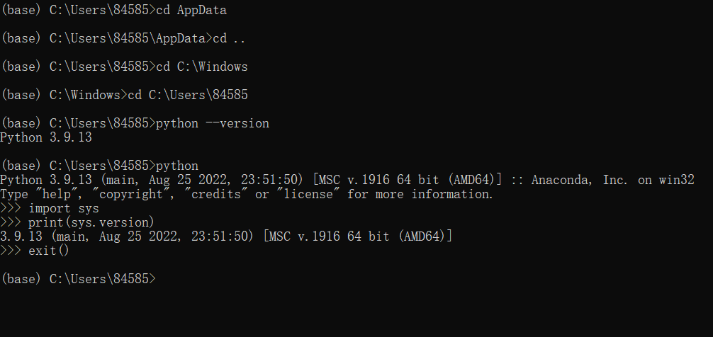
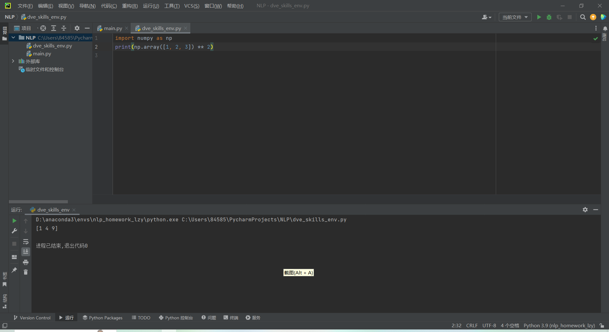

# 魈的自我介绍

**大家好，我是魈**

---

## 基础档案

### 外貌特征
- 青色的短发，金色瞳孔
- 佩戴傩面，身着墨绿色衣袍
- 周身缠绕风元素气息

## 我的好朋友
1. 钟离（往生堂客卿）
2. 旅行者
3. ~~温迪~~（划掉：因饮酒问题常被嫌弃）

### 重要坐标
[住址：望舒客栈顶层](https://baike.baidu.com/item/%E6%9C%9B%E8%88%92%E5%AE%A2%E6%A0%88/24622894)

### 日常作息表
| 时间 | 活动 |
|------|------|
| 子时 | 除魔 |
| 卯时 | 休憩 |
| 戌时 | 巡视荻花洲 |

### 人生信条
> "诸行无常，一切皆苦。"

---

## 我的专业是夜叉除魔

## 我最喜欢的一段代码
```python
import numpy as np
print(np.array([1, 2, 3]) ** 2)
```
其中执行`print(np.array([1, 2, 3]) ** 2)`可输出结果。
### 我最喜欢的环境管理工具是conda


### 我可以在IDE上使用我建立的虚拟环境


欧拉公式可以表示为 $e^{i\pi} + 1 = 0$，这是一个著名的等式。

$$
e^{i\pi} + 1 = 0
$$